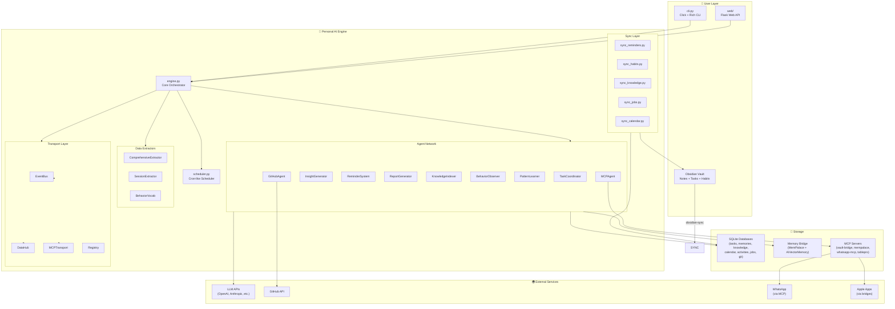
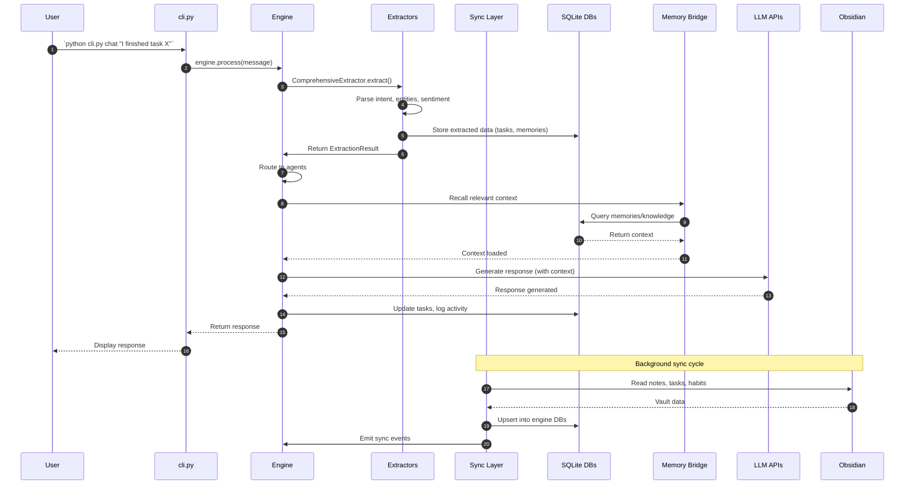
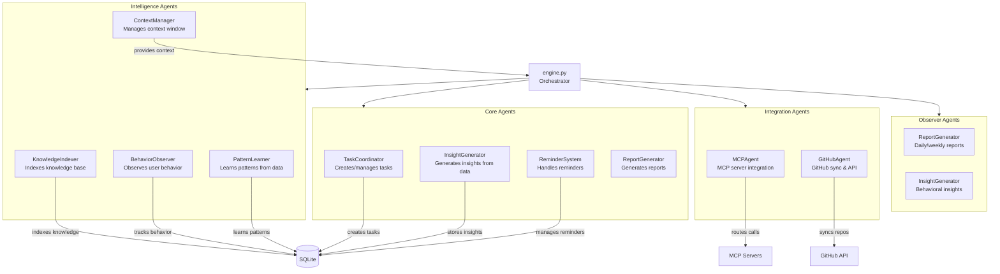
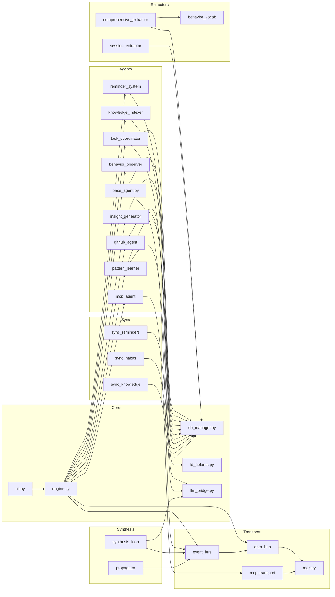
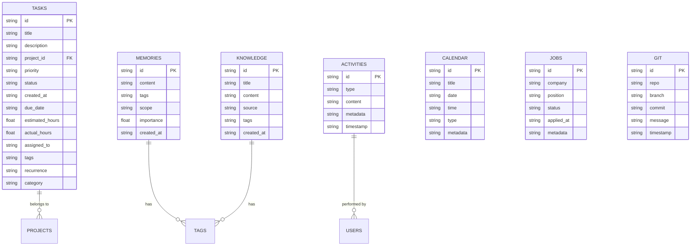
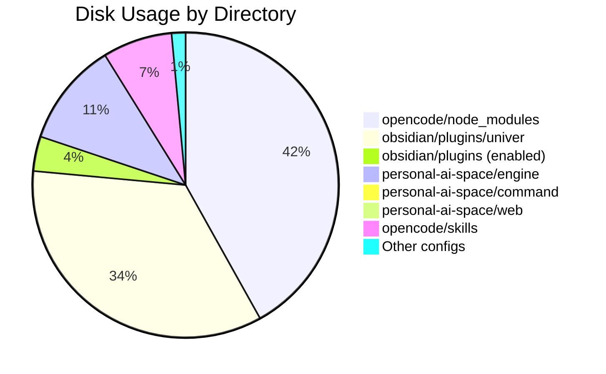

```mermaid
flowchart LR
    subgraph Entry["Entry Points"]
        ENGINE["engine.py<br/>Core Orchestrator"]
        CLI["cli.py<br/>Command Line"]
        WEB["web/api/<br/>Flask Routes"]
        INIT["init_engine.py<br/>Bootstrap"]
    end

    subgraph Agents["Agents (brain/agents/)"]
        BASE["base_agent.py"]
        TC["task_coordinator"]
        IG["insight_generator"]
        RS["reminder_system"]
        RG["report_generator"]
        KI["knowledge_indexer"]
        BO["behavior_observer"]
        PL["pattern_learner"]
        MCP_A["mcp_agent"]
        GH_A["github_agent"]
        CTX["context_manager"]
    end

    subgraph Extractors["Extractors (brain/extractors/)"]
        CE["comprehensive_extractor"]
        SE["session_extractor"]
        BV["behavior_vocab"]
        SC["session_storage"]
        CONV["converters"]
    end

    subgraph Sync["Sync (brain/sync/)"]
        SR["sync_reminders"]
        SH["sync_habits"]
        SK["sync_knowledge"]
        SJ["sync_jobs"]
        SCAL["sync_calendar"]
        SSELF["sync_self"]
        SSRC["sync_scanner"]
        ABS["absorb_command_data"]
        WA["whatsapp_jobs_import"]
    end

    subgraph Transport["Transport (brain/transport/)"]
        EB["event_bus"]
        DH["data_hub"]
        MT["mcp_transport"]
        REG["registry"]
        CFG["config"]
        T["types"]
    end

    subgraph Synthesis["Synthesis (brain/synthesis/)"]
        SL["synthesis_loop"]
        SR2["synthesis_run"]
        PROP["propagator"]
    end

    subgraph Analytics["Analytics (brain/analytics/)"]
        BA["behavior_analytics"]
        TI["trait_inference"]
    end

    subgraph Memory["Memory (brain/memory/)"]
        MB["mcp_bridge"]
        FB["fallback_bridge"]
    end

    subgraph Storage["Storage (brain/db/)"]
        DM["db_manager.py"]
        ID["id_helpers.py"]
        DBS["activities/ calendar/ git/ jobs/<br/>knowledge/ memories/ self/ tasks/"]
    end

    Entry --> Agents
    Agents --> Extractors
    Agents --> Transport
    Agents --> Synthesis
    Agents --> Analytics
    Agents --> Memory
    Agents --> Storage

    Extractors --> Storage
    Sync --> Storage
    Sync --> Agents
    Transport --> Agents
    Synthesis --> Transport
```

# Codebase Map — Personal AI Powerhouse

> Generated: 2026-06-12 | Branch: `small-version` | After cleanup: 283MB disk, ~600 tracked files

---

## 1. System Landscape

### Mermaid Diagram


### ASCII Fallback
```text
┌─────────────────────────────────────────────────────────────────────┐
│                        USER LAYER                                   │
│  ┌──────────┐  ┌──────────┐  ┌──────────────┐                     │
│  │  cli.py  │  │  web/    │  │  Obsidian    │                     │
│  │ (Click)  │  │ (Flask)  │  │  Vault       │                     │
│  └────┬─────┘  └────┬─────┘  └──────┬───────┘                     │
│       │              │               │                              │
├───────┼──────────────┼───────────────┼──────────────────────────────┤
│       ▼              ▼               ▼                              │
│  ┌─────────────────────────────────────────────────────────────┐   │
│  │              PERSONAL AI ENGINE                              │   │
│  │  ┌─────────────┐  ┌──────────────┐  ┌──────────────────┐   │   │
│  │  │  engine.py  │  │  scheduler   │  │  Extractors      │   │   │
│  │  │ (Core)      │  │  (Cron)      │  │  (Session,       │   │   │
│  │  │             │  │              │  │   Comprehensive)  │   │   │
│  │  └──────┬──────┘  └──────────────┘  └──────────────────┘   │   │
│  │         │                                                   │   │
│  │  ┌──────┴──────────────────────────────────────────────┐    │   │
│  │  │              AGENT NETWORK                           │    │   │
│  │  │  TaskCoord │ Insight  │ Reminder │ Report │ Know    │    │   │
│  │  │  Behavior  │ Pattern  │ MCP      │ GitHub │ ...     │    │   │
│  │  └─────────────────────────────────────────────────────┘    │   │
│  │         │                                                   │   │
│  │  ┌──────┴──────────────────────────────────────────────┐    │   │
│  │  │              TRANSPORT LAYER                         │    │   │
│  │  │  EventBus ←→ DataHub ←→ MCPTransport ←→ Registry   │    │   │
│  │  └─────────────────────────────────────────────────────┘    │   │
│  └─────────────────────────────────────────────────────────────┘   │
│       │              │               │                              │
├───────┼──────────────┼───────────────┼──────────────────────────────┤
│       ▼              ▼               ▼                              │
│  ┌──────────┐  ┌──────────┐  ┌──────────────┐  ┌──────────────┐  │
│  │ SQLite   │  │ Memory   │  │ MCP Servers  │  │  External    │  │
│  │ DBs      │  │ Bridge   │  │ (vault, mp,  │  │  (LLM, GH,  │  │
│  │ (7 DBs)  │  │          │  │  whatsapp)   │  │   WhatsApp)  │  │
│  └──────────┘  └──────────┘  └──────────────┘  └──────────────┘  │
└─────────────────────────────────────────────────────────────────────┘
```

---

## 2. Engine Architecture

### Mermaid Diagram


### ASCII Fallback
```text
ENTRY POINTS                    AGENTS
┌──────────────┐               ┌─────────────────────────────┐
│ engine.py    │──────────────▶│ base_agent.py               │
│ cli.py       │               │ task_coordinator             │
│ web/api/     │               │ insight_generator            │
│ init_engine  │               │ reminder_system              │
└──────────────┘               │ report_generator             │
                               │ knowledge_indexer            │
                               │ behavior_observer            │
                               │ pattern_learner              │
                               │ mcp_agent                    │
                               │ github_agent                 │
                               │ context_manager              │
                               └──────────┬──────────────────┘
                                          │
          ┌───────────────┬───────────────┼───────────────┬──────────────┐
          ▼               ▼               ▼               ▼              ▼
   ┌─────────────┐ ┌─────────────┐ ┌─────────────┐ ┌──────────┐ ┌──────────┐
   │ EXTRACTORS  │ │    SYNC     │ │  TRANSPORT  │ │SYNTHESIS │ │ MEMORY   │
   │ session     │ │ reminders   │ │ event_bus   │ │ loop     │ │ mcp      │
   │ comprehensive│ │ habits     │ │ data_hub    │ │ run      │ │ bridge   │
   │ behavior    │ │ knowledge   │ │ mcp_transp  │ │ propa-   │ │ fallback │
   │ converters  │ │ jobs        │ │ registry    │ │ gator    │ │ bridge   │
   └──────┬──────┘ │ calendar    │ │ config      │ └────┬─────┘ └────┬─────┘
          │        │ self        │ │ types       │      │            │
          │        │ scanner     │ └──────┬──────┘      │            │
          │        │ whatsapp    │        │             │            │
          │        └──────┬──────┘        │             │            │
          │               │               │             │            │
          ▼               ▼               ▼             ▼            ▼
   ┌─────────────────────────────────────────────────────────────────────┐
   │                        STORAGE (SQLite)                             │
   │  db_manager.py │ id_helpers.py                                      │
   │  ┌─────────┬─────────┬─────────┬─────────┬─────────┬─────────┐    │
   │  │activities│calendar │  git    │  jobs   │knowledge│memories │    │
   │  ├─────────┼─────────┼─────────┼─────────┼─────────┼─────────┤    │
   │  │  self   │  tasks  │         │         │         │         │    │
   │  └─────────┴─────────┴─────────┴─────────┴─────────┴─────────┘    │
   └─────────────────────────────────────────────────────────────────────┘
```

---

## 3. Data Flow

### Mermaid Diagram


### ASCII Fallback
```text
 User          CLI          Engine       Extractors      DB        Memory       LLM        Obsidian
  │             │             │             │             │          │           │            │
  │──"chat"────▶│──process───▶│             │             │          │           │            │
  │             │             │──extract───▶│             │          │           │            │
  │             │             │             │──store─────▶│          │           │            │
  │             │             │◀─result─────│             │          │           │            │
  │             │             │             │             │          │           │            │
  │             │             │──recall─────────────────▶│          │           │            │
  │             │             │◀─context─────────────────│          │           │            │
  │             │             │             │             │          │           │            │
  │             │             │──generate──────────────────────────────────────▶│            │
  │             │             │◀─response──────────────────────────────────────│            │
  │             │             │             │             │          │           │            │
  │             │◀─response───│──update────▶│             │          │           │            │
  │◀─display───│             │             │             │          │           │            │
  │             │             │             │             │          │           │            │
  │             │             │             │     BACKGROUND SYNC              │            │
  │             │             │             │             │          │           │            │
  │             │             │             │             │◀──read──────────────────────────│
  │             │             │             │             │──upsert────────────────────────▶│
```

---

## 4. Agent Network

### Mermaid Diagram


---

## 5. Module Dependency Graph

### Mermaid Diagram


---

## 6. Database Schema Overview

### Mermaid Diagram


---

## 7. File Size Breakdown (Post-Cleanup)



| Directory | Size | Purpose |
|-----------|------|---------|
| `.opencode/node_modules/` | 57 MB | OpenCode plugin dependencies |
| `.obsidian/plugins/univer/` | 47 MB | Spreadsheet editor (disable if unused) |
| `.obsidian/plugins/` (9 enabled) | ~5 MB | Active Obsidian plugins |
| `.obsidian/themes/` | ~200 KB | Alien (active) + Obsidianite |
| `personal-ai-space/engine/` | ~15 MB | Core engine Python code |
| `personal-ai-space/command/` | ~1 MB | 86 command files |
| `personal-ai-space/web/` | ~200 KB | Flask web API |
| `02 - Self/` | ~100 KB | Profile, traits, goals |
| `personal-ai-space/docs/` | ~1 MB | Architecture docs |
| `.opencode/skills/` | ~10 MB | 30 skill directories |
| `.opencode/command/` | ~56 KB | 7 slash commands |
| `.opencode/agent/` | ~20 KB | Agent definitions |
| Root configs | ~50 KB | AGENTS.md, opencode.json, etc. |

**Total: ~283 MB** (down from 1.1 GB)

---

## 8. Quick Reference

### Entry Points
| File | Purpose | Usage |
|------|---------|-------|
| `personal-ai-space/engine/engine.py` | Core orchestrator | `python engine.py` |
| `personal-ai-space/engine/cli.py` | CLI interface | `python cli.py [command]` |
| `personal-ai-space/web/api/` | Flask web API | `python -m flask run` |
| `personal-ai-space/engine/init_engine.py` | Bootstrap | First-time setup |

### Key Config Files
| File | Purpose |
|------|---------|
| `opencode.json` | MCP server configuration |
| `AGENTS.md` | Agent workflow rules |
| `.gitignore` | Git exclusions |
| `.env` | Secrets (gitignored) |
| `.obsidian/community-plugins.json` | Enabled Obsidian plugins |

### Database Locations
| Database | Path | Purpose |
|----------|------|---------|
| tasks.db | `engine/db/tasks/` | Task management |
| memories.db | `engine/db/memories/` | Memory storage |
| knowledge.db | `engine/db/knowledge/` | Knowledge base |
| calendar.db | `engine/db/calendar/` | Calendar events |
| activities.db | `engine/db/activities/` | Activity log |
| jobs.db | `engine/db/jobs/` | Job tracking |
| git.db | `engine/db/git/` | Git integration |
| self.db | `engine/db/self/` | Self/profile data |
