# Personal AI Powerhouse — Architecture Map

```mermaid
graph TB
  classDef engine fill:#2d1b69,color:#fff,stroke:#7c3aed
  classDef agent fill:#1e3a5f,color:#fff,stroke:#3b82f6
  classDef learner fill:#1a3d2e,color:#fff,stroke:#22c55e
  classDef memory fill:#3b1f3b,color:#fff,stroke:#a855f7
  classDef data fill:#3a2a1a,color:#fff,stroke:#f59e0b
  classDef cmd fill:#3a1a1a,color:#fff,stroke:#ef4444
  classDef infra fill:#1a2a3a,color:#fff,stroke:#06b6d4

  subgraph ENGINE["🧠 ENGINE — AI Brain"]
    direction TB
    subgraph Core["Core"]
      engine_py["engine.py<br/>Orchestrator"]:::engine
      cli_py["cli.py<br/>20+ user commands"]:::engine
      db_mgr["db_manager.py<br/>SQLite queries"]:::engine
      log_mgr["log_manager.py<br/>Logging + audit"]:::engine
    end

    subgraph Agents["Agents (6 active)"]
      cm["context-manager<br/>Profile + MCP bridge"]:::agent
      tc["task-coordinator<br/>CRUD + priorities"]:::agent
      ig["insight-generator<br/>Habit patterns"]:::agent
      rs["reminder-system<br/>Scheduled reminders"]:::agent
      ki["knowledge-indexer<br/>Index + search"]:::agent
      rg["report-generator<br/>Digests + reviews"]:::agent
    end

    subgraph Learning["Learning System"]
      bo["behavior-observer<br/>Logs user actions"]:::learner
      pl["pattern-learner<br/>Infers workflows"]:::learner
    end

    subgraph Memory["MCP Memory Server (Node.js)"]
      bridge["mcp_bridge.py<br/>Python → Node subprocess"]:::memory
      store["store.ts<br/>SQLite CRUD"]:::memory
      consolidator["consolidator.ts<br/>Knowledge extraction"]:::memory
      injector["injector.ts<br/>Context injection"]:::memory
      nlp["nlp-interface.ts<br/>Intent routing"]:::memory
      cli_ts["cli.ts / demo-cli.ts<br/>Interactive REPL"]:::memory
      bootstrap["bootstrap.ts / index.ts<br/>Server lifecycle"]:::memory
    end
  end

  subgraph SELF["👤 SELF — Digital Twin"]
    profile["profile.json"]:::data
    habits["habits/"]:::data
    traits_dir["traits/"]:::data
    needs_dir["needs/"]:::data
    behaviors_dir["behaviors/"]:::data
    insights_dir["insights/"]:::data
  end

  subgraph COMMAND["🎯 COMMAND — Control Center"]
    tasks_dir["tasks/"]:::cmd
    calendar_dir["calendar/"]:::cmd
    finances_dir["finances/"]:::cmd
    activities_dir["activities/"]:::cmd
    inbox_dir["inbox/"]:::cmd
  end

  subgraph KNOWLEDGE["📚 KNOWLEDGE — Library"]
    articles_dir["articles/"]:::data
    notes_dir["notes/"]:::data
    references_dir["references/"]:::data
    projects_dir["projects/"]:::data
  end

  subgraph INFRA["⚙️ INFRASTRUCTURE"]
    docs["📄 docs/<br/>14 documentation files"]:::infra
    intake["📥 intake/<br/>Watcher + auto-processor<br/>(macOS launchd service)"]:::infra
    storage["💾 Storage<br/>agent_memory.db (SQLite)<br/>memories / self / tasks / knowledge"]:::infra
    vault_dir["🔒 vault/<br/>Secrets (git-ignored)"]:::infra
    mail_mcp["📧 mcp-servers/mail-mcp/<br/>External email MCP server"]:::infra
  end

  engine_py -->|orchestrates| cm
  engine_py -->|orchestrates| tc
  engine_py -->|orchestrates| ig
  engine_py -->|orchestrates| rs
  engine_py -->|orchestrates| ki
  engine_py -->|orchestrates| rg
  engine_py --- bridge
  cli_py -->|invokes| engine_py

  bridge -->|subprocess| store
  store --> consolidator
  store --> injector
  store --> nlp

  cm -->|reads| profile
  cm --- habits
  cm --- traits_dir
  pl -->|stores patterns| store

  tc -->|manages| tasks_dir
  bo -->|observes| inbox_dir

  ki -->|indexes| articles_dir
  ki --- notes_dir
  ki --- references_dir

  intake -->|auto-routes| inbox_dir
  intake -->|auto-routes| articles_dir
  intake -->|auto-routes| notes_dir

  engine_py --- db_mgr
  db_mgr --- storage
  log_mgr ---|writes logs| storage
```

## Overview

| Layer | Contents | Technology |
|-------|----------|------------|
| **Engine** | Orchestrator, CLI, 6 agents, learning system, MCP memory | Python + Node.js |
| **Self** | Profile, habits, traits, needs, behaviors, insights | JSON files |
| **Command** | Tasks, calendar, finances, activities, inbox | JSON + SQLite |
| **Knowledge** | Articles, notes, references, projects | Markdown + SQLite |
| **Infrastructure** | Docs, intake watcher, databases, vault, external MCP | Python + launchd + SQLite |
