# Pipeline de Briefings Automáticos

Diagrama visual do fluxo completo dos 3 briefings diários (manhã, meio-dia, fim do dia).

```mermaid
flowchart TD
    %% ============ SCHEDULER TRIGGER ============
    Scheduler["⏰ Scheduler\n(30s interval)"]
    Runner["🤖 AutomationRunner.run()"]
    DueCheck{"_is_due()\ncheck?"}
    
    Scheduler --> Runner --> DueCheck
    
    DueCheck -->|"Yes"| Morning["🌅 morning_brief\n07:00"]
    DueCheck -->|"Yes"| Midday["☀️ midday_checkpoint\n12:00"]
    DueCheck -->|"Yes"| EndOfDay["🌙 end_of_day\n18:00"]
    
    %% ============ MORNING BRIEF ============
    subgraph Morning["🌅 morning_brief (07:00)"]
        direction TB
        
        M1["📊 DATA FETCHED"]
        M1a["🗄️ tasks db\ntasks table"]
        M1b["🗄️ calendar db\nupcoming table"]
        M1c["🗄️ self db\nhabits table"]
        M1d["🗄️ self db\ngoals table"]
        
        M1 --> M1a
        M1 --> M1b
        M1 --> M1c
        M1 --> M1d
        
        M2["⚙️ DATA PROCESSING"]
        M2a["📋 Query: tasks_due_today\n<code>JOIN projects WHERE status≠completed\nORDER BY priority</code>"]
        M2b["📅 Query: calendar_today\n<code>WHERE event_date=today</code>"]
        M2c["🎯 Query: habits_at_risk\n<code>WHERE last_completed < yesterday</code>"]
        M2d["🎯 Query: goals_active\n<code>WHERE status LIKE '%in_progress%'</code>"]
        
        M1a --> M2a
        M1b --> M2b
        M1c --> M2c
        M1d --> M2d
        
        M3["✨ Formatting & Assembly"]
        M3a["_format_item()\nTasks: #project (due_date) [priority]\nHabits: streak:N, last:YYYY-MM-DD\nGoals: até YYYY-MM-DD\nCalendar: HH:MM"]
        M3b["format_section()\nadds (N) count to label"]
        M3c["build_brief_message()\njoins sections with \\n\\n"]
        
        M2a --> M3a
        M2b --> M3a
        M2c --> M3a
        M2d --> M3a
        M3a --> M3b --> M3c
        
        M4["📤 DATA OUTPUT"]
        M4a["💬 WhatsApp\nHeader: 🌅 Bom dia! · 📋7 · 📅2 · 🎯1\nBody: sections + footer"]
        M4b["🔔 macOS Notification\n\"7 tasks · 2 eventos · 0 hábitos · 1 meta\""]
        M4c["📱 Apple Reminders\n• 📋 Tarefas do Dia\n• 📅 Agenda de Hoje\n• 🎯 Hábitos em Risco\n• 🎯 Metas Ativas"]
        
        M3c --> M4
        M4 --> M4a
        M4 --> M4b
        M4 --> M4c
    end
    
    %% ============ MIDDAY CHECKPOINT ============
    subgraph Midday["☀️ midday_checkpoint (12:00)"]
        direction TB
        
        Md1["📊 DATA FETCHED"]
        Md1a["🗄️ tasks db\ntasks table"]
        Md1b["🗄️ self db\nhabits table"]
        Md1c["🗄️ self db\nhabit_logs table"]
        
        Md1 --> Md1a
        Md1 --> Md1b
        Md1 --> Md1c
        
        Md2["⚙️ DATA PROCESSING"]
        Md2a["📋 Query: tasks_remaining\n<code>WHERE due_date ≤ today\nAND status ≠ completed</code>"]
        Md2b["✅ Query: habits_today_status\n<code>habits LEFT JOIN habit_logs\nshows ✅ or ⬜</code>"]
        Md2c["⚠️ Query: habits_at_risk\n<code>last_completed < yesterday</code>"]
        
        Md1a --> Md2a
        Md1b --> Md2b
        Md1c --> Md2b
        Md1b --> Md2c
        
        Md3["✨ Formatting & Assembly"]
        Md3a["_format_item()\nTasks: #project (due_date) [priority]\nHabits: streak:N, last:YYYY-MM-DD"]
        Md3b["format_section()\nadds (N) count"]
        Md3c["build_brief_message()"]
        
        Md2a --> Md3a
        Md2b --> Md3a
        Md2c --> Md3a
        Md3a --> Md3b --> Md3c
        
        Md4["📤 DATA OUTPUT"]
        Md4a["💬 WhatsApp\nHeader: ☀️ Boa tarde! · 5 tasks · 3 hábitos\nBody + footer"]
        Md4b["🔔 macOS Notification\n\"5 tasks restam · 3 hábitos · 1 em risco\""]
        Md4c["📱 Apple Reminders\n• 📋 Restam do Dia\n• 🎯 Status dos Hábitos\n• ⚠️ Hábitos em Risco"]
        
        Md3c --> Md4
        Md4 --> Md4a
        Md4 --> Md4b
        Md4 --> Md4c
    end
    
    %% ============ END OF DAY ============
    subgraph EndOfDay["🌙 end_of_day (18:00)"]
        direction TB
        
        E1["📊 DATA FETCHED"]
        E1a["🗄️ tasks db\ntasks table"]
        E1b["🗄️ self db\nhabit_logs table"]
        
        E1 --> E1a
        E1 --> E1b
        
        E2["⚙️ DATA PROCESSING"]
        E2a["✅ Query: tasks_completed_today\n<code>WHERE status='completed'\nAND updated_at=today</code>"]
        E2b["🎯 Query: habits_completed_today\n<code>habit_logs JOIN habits\nWHERE completed_at=today</code>"]
        
        E1a --> E2a
        E1b --> E2b
        
        E3["✨ Formatting & Assembly"]
        E3a["_format_item()\nTasks: #project (due_date) [priority]"]
        E3b["format_section()\nadds (N) count"]
        E3c["build_brief_message()"]
        
        E2a --> E3a
        E2b --> E3a
        E3a --> E3b --> E3c
        
        E4["📤 DATA OUTPUT"]
        E4a["💬 WhatsApp\nHeader: 🌙 Boa noite! · 3 tasks · 2 hábitos\nBody + footer"]
        E4b["🔔 macOS Notification\n\"3 tasks concluídas · 2 hábitos hoje\""]
        E4c["📱 Apple Reminders\n• ✅ Concluído Hoje\n• 💪 Hábitos do Dia"]
        
        E3c --> E4
        E4 --> E4a
        E4 --> E4b
        E4 --> E4c
    end
    
    %% ============ DELIVERY CHANNELS ============
    subgraph Delivery["📡 3 Canais de Saída"]
        D1["💬 WhatsApp API\nPOST localhost:8080/api/send\nfila de retry em disco"]
        D2["🔔 macOS Notification\nosascript → Notification Center"]
        D3["📱 Apple Reminders\nreminders-bridge CLI\ncompleta anterior → cria nova → set-due"]
    end
    
    Morning --- Delivery
    Midday --- Delivery
    EndOfDay --- Delivery

    subgraph Legend["🎨 Legenda"]
        direction LR
        L1["🔵 Fetch: dados brutos do DB"]
        L2["🟡 Process: queries SQL"]
        L3["🟠 Format: formatação + montagem"]
        L4["🟢 Output: 3 canais de entrega"]
    end

    style Scheduler fill:#2d3748,stroke:#4a5568,color:#fff
    style Runner fill:#4a5568,stroke:#718096,color:#fff
    style DueCheck fill:#2b6cb0,stroke:#4299e1,color:#fff

    style Morning fill:#1a365d,stroke:#2b6cb0,color:#fff
    style M1 fill:#2c5282,stroke:#4299e1,color:#fff
    style M1a fill:#2c5282,stroke:#4299e1,color:#fff
    style M1b fill:#2c5282,stroke:#4299e1,color:#fff
    style M1c fill:#2c5282,stroke:#4299e1,color:#fff
    style M1d fill:#2c5282,stroke:#4299e1,color:#fff
    style M2 fill:#744210,stroke:#d69e2e,color:#fff
    style M2a fill:#744210,stroke:#d69e2e,color:#fff
    style M2b fill:#744210,stroke:#d69e2e,color:#fff
    style M2c fill:#744210,stroke:#d69e2e,color:#fff
    style M2d fill:#744210,stroke:#d69e2e,color:#fff
    style M3 fill:#7b341e,stroke:#ed8936,color:#fff
    style M3a fill:#7b341e,stroke:#ed8936,color:#fff
    style M3b fill:#7b341e,stroke:#ed8936,color:#fff
    style M3c fill:#7b341e,stroke:#ed8936,color:#fff
    style M4 fill:#276749,stroke:#48bb78,color:#fff
    style M4a fill:#276749,stroke:#48bb78,color:#fff
    style M4b fill:#276749,stroke:#48bb78,color:#fff
    style M4c fill:#276749,stroke:#48bb78,color:#fff

    style Midday fill:#1a365d,stroke:#2b6cb0,color:#fff
    style Md1 fill:#2c5282,stroke:#4299e1,color:#fff
    style Md1a fill:#2c5282,stroke:#4299e1,color:#fff
    style Md1b fill:#2c5282,stroke:#4299e1,color:#fff
    style Md1c fill:#2c5282,stroke:#4299e1,color:#fff
    style Md2 fill:#744210,stroke:#d69e2e,color:#fff
    style Md2a fill:#744210,stroke:#d69e2e,color:#fff
    style Md2b fill:#744210,stroke:#d69e2e,color:#fff
    style Md2c fill:#744210,stroke:#d69e2e,color:#fff
    style Md3 fill:#7b341e,stroke:#ed8936,color:#fff
    style Md3a fill:#7b341e,stroke:#ed8936,color:#fff
    style Md3b fill:#7b341e,stroke:#ed8936,color:#fff
    style Md3c fill:#7b341e,stroke:#ed8936,color:#fff
    style Md4 fill:#276749,stroke:#48bb78,color:#fff
    style Md4a fill:#276749,stroke:#48bb78,color:#fff
    style Md4b fill:#276749,stroke:#48bb78,color:#fff
    style Md4c fill:#276749,stroke:#48bb78,color:#fff

    style EndOfDay fill:#1a365d,stroke:#2b6cb0,color:#fff
    style E1 fill:#2c5282,stroke:#4299e1,color:#fff
    style E1a fill:#2c5282,stroke:#4299e1,color:#fff
    style E1b fill:#2c5282,stroke:#4299e1,color:#fff
    style E2 fill:#744210,stroke:#d69e2e,color:#fff
    style E2a fill:#744210,stroke:#d69e2e,color:#fff
    style E2b fill:#744210,stroke:#d69e2e,color:#fff
    style E3 fill:#7b341e,stroke:#ed8936,color:#fff
    style E3a fill:#7b341e,stroke:#ed8936,color:#fff
    style E3b fill:#7b341e,stroke:#ed8936,color:#fff
    style E3c fill:#7b341e,stroke:#ed8936,color:#fff
    style E4 fill:#276749,stroke:#48bb78,color:#fff
    style E4a fill:#276749,stroke:#48bb78,color:#fff
    style E4b fill:#276749,stroke:#48bb78,color:#fff
    style E4c fill:#276749,stroke:#48bb78,color:#fff

    style Delivery fill:#553c9a,stroke:#805ad5,color:#fff
    style D1 fill:#553c9a,stroke:#805ad5,color:#fff
    style D2 fill:#553c9a,stroke:#805ad5,color:#fff
    style D3 fill:#553c9a,stroke:#805ad5,color:#fff

    style Legend fill:#1a202c,stroke:#718096,color:#fff
    style L1 fill:#2c5282,stroke:#4299e1,color:#fff
    style L2 fill:#744210,stroke:#d69e2e,color:#fff
    style L3 fill:#7b341e,stroke:#ed8936,color:#fff
    style L4 fill:#276749,stroke:#48bb78,color:#fff
```

## Arquivos Relacionados

| Arquivo | Função |
|---------|--------|
| `automations/runner.py` | Motor de regras — queries, formatação, schedule |
| `automations/delivery.py` | Entrega multicanal — WhatsApp, Notification, Reminders |
| `automations/templates.py` | Templates de texto (greeting, section labels) |
| `config/automations.yaml` | Definição declarativa das 7 regras |
