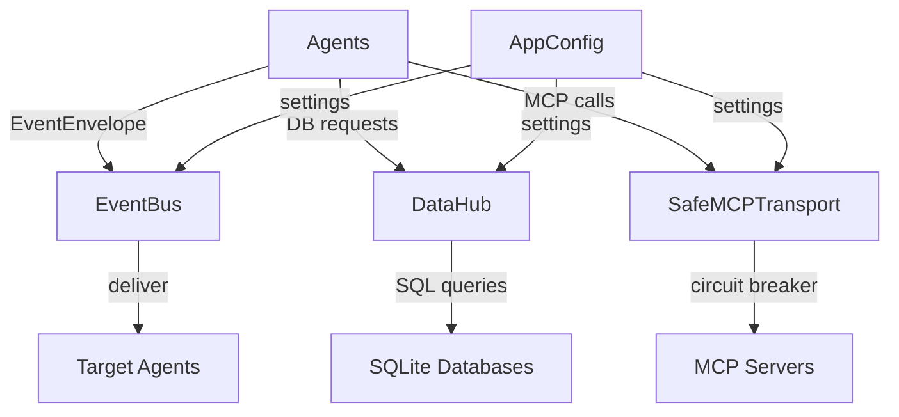

# personal-ai-space/engine/transport/

## Responsibility
Modular data transport layer — decouples inter-agent communication, database access, and MCP server integration. Replaces direct imports and ad-hoc coupling with a typed, validated message bus architecture. Implements circuit breaker pattern for resilience and provides centralized configuration management.

## Design Patterns

### Event-Driven Architecture
- **EventBus**: In-memory publish/subscribe message router (Observer pattern)
- **EventEnvelope**: Typed message schema with Pydantic validation (DTO pattern)
- **Request-Reply**: Synchronous message pattern with timeout support

### Facade Pattern
- **DataHub**: Unified interface to multiple SQLite databases with typed methods
- **SafeMCPTransport**: Resilient wrapper around MCP client with circuit breaker

### Resilience Patterns
- **Circuit Breaker**: Three-state (CLOSED → OPEN → HALF_OPEN) failure isolation
- **Exponential Backoff**: Automatic retry with increasing delays (1s, 2s, 4s)
- **Graceful Fallback**: Returns cached/empty responses instead of raising exceptions

### Configuration Management
- **AppConfig**: Singleton pattern with environment variable overrides
- **Type-Safe Loading**: Pydantic validation for all configuration values

## Core Files

| File | Responsibility | Key Components |
|------|---------------|----------------|
| `types.py` | Typed message schemas and enums | `EventEnvelope`, `EventResponse`, `ActionType`, `Priority` |
| `event_bus.py` | Publish/subscribe message router | `EventBus` class with `publish()`, `subscribe()`, `request()` |
| `data_hub.py` | Database access facade | `DataHub` class with typed methods for all DB operations |
| `mcp_transport.py` | Resilient MCP communication | `SafeMCPTransport`, `CircuitBreaker`, `MCPTransportManager` |
| `config.py` | Centralized configuration | `AppConfig` singleton with environment variable loading |
| `registry.py` | MCP server registry loader | `MCPServerConfig`, type-safe registry loading |

## Architecture



## Data Flow

### Inter-Agent Communication
1. Agent creates `EventEnvelope` with typed payload
2. Agent calls `EventBus.publish(topic, envelope)` or `EventBus.request(envelope)`
3. EventBus validates envelope with Pydantic
4. EventBus delivers to all subscribers of the topic
5. Subscribers process message and optionally reply via response topic

### Database Access
1. Agent calls `DataHub.get_user_profile()` (typed method)
2. DataHub logs audit entry via `log_manager.audit()`
3. DataHub executes query through `db_manager` connection pool
4. DataHub returns typed result (Pydantic model or dict)
5. Agent receives data without direct SQL exposure

### MCP Server Communication
1. Agent calls `MCPTransportManager.call_tool(server_id, tool, args)`
2. TransportManager gets `SafeMCPTransport` for server
3. SafeMCPTransport checks circuit breaker state
4. If CLOSED/HALF_OPEN: attempt request with exponential backoff
5. If OPEN: return graceful fallback response immediately
6. On success: record success, potentially close circuit
7. On failure: record failure, potentially open circuit

## Integration Points

### Consumed By
- **All 8 engine agents**: Use EventBus for communication, DataHub for data access
- **Engine orchestrator**: Uses EventBus for agent dispatch
- **Context Manager**: Primary consumer of DataHub and MCPTransport
- **Behavior Observer**: Uses DataHub for observation persistence
- **MCP Agent**: Uses SafeMCPTransport for all external MCP calls

### Dependencies
- **db_manager.py**: Underlying database connection management
- **log_manager.py**: Audit logging for DataHub operations
- **mcp_tools.base_client**: Base MCP client implementation
- **pydantic**: Schema validation and type safety
- **registry.json**: MCP server configuration

## Configuration

### Environment Variables
```bash
# Ollama embedding server
OLLAMA_URL=http://localhost:11434/api/embed
OLLAMA_MODEL=nomic-embed-text:137m-v1.5-fp16

# Database paths
MEMORY_DB_DIR=personal-ai-space/engine/db
DATA_DIR=personal-ai-space

# MCP configuration
MCP_REGISTRY_PATH=personal-ai-space/engine/mcp_tools/registry.json
MCP_SERVER_DIR=personal-ai-space/engine/memory/mcp-server

# Timeouts and thresholds
CONTEXT_TTL_SECONDS=300
MCP_TIMEOUT_SECONDS=30
MCP_MAX_RETRIES=3
```

### Circuit Breaker Settings
- **Failure threshold**: 3 consecutive failures
- **Cooldown period**: 30 seconds in OPEN state
- **Half-open testing**: 1 request allowed to test recovery
- **Success threshold**: 1 success to close circuit

## Testing

### Test Coverage
- **Unit tests**: 41 tests in `transport/tests/test_transport.py`
- **Coverage**: EventEnvelope validation, EventBus routing, DataHub methods, CircuitBreaker state machine, SafeMCPTransport fallback
- **Test types**: Happy path, error handling, timeout scenarios, configuration validation

### Key Test Scenarios
- EventEnvelope validation (valid/invalid payloads)
- EventBus publish/subscribe delivery
- EventBus request/reply pattern with timeout
- DataHub query results match direct SQL
- CircuitBreaker state transitions (CLOSED→OPEN→HALF_OPEN→CLOSED)
- SafeMCPTransport graceful fallback on circuit open

## Performance Characteristics

- **EventBus**: In-memory, ~10μs message delivery, 10K message queue capacity
- **DataHub**: Connection pooling, ~1-5ms query execution
- **SafeMCPTransport**: Circuit breaker adds <1ms overhead, retry backoff prevents thundering herd
- **Memory**: Minimal overhead (~5MB for transport layer components)

## Migration Guide

### From Direct Imports to Transport Layer

**Before:**
```python
import db_manager as db
from memory.mcp_bridge import MCPMemoryBridge

# Direct database access
profile = db.query('self', 'SELECT * FROM profile LIMIT 1')

# Direct MCP calls
bridge = MCPMemoryBridge()
facts = bridge.get_facts()
```

**After:**
```python
from transport.data_hub import DataHub
from transport.mcp_transport import MCPTransportManager

# Typed database access
hub = DataHub()
profile = hub.get_user_profile()

# Resilient MCP calls
manager = MCPTransportManager()
facts = manager.call_tool('memory', 'list_facts', {})
```

### From Direct Agent Calls to EventBus

**Before:**
```python
# engine.py directly calls agent methods
result = agent.handle(command)
```

**After:**
```python
# engine.py publishes to EventBus
from transport.event_bus import EventBus
from transport.types import EventEnvelope, ActionType

bus = EventBus()
envelope = EventEnvelope(
    id='cmd-123',
    sender='engine',
    recipients=[agent.id],
    action=ActionType.REQUEST,
    payload={'command': command}
)
response = bus.request(envelope, timeout=30)
```