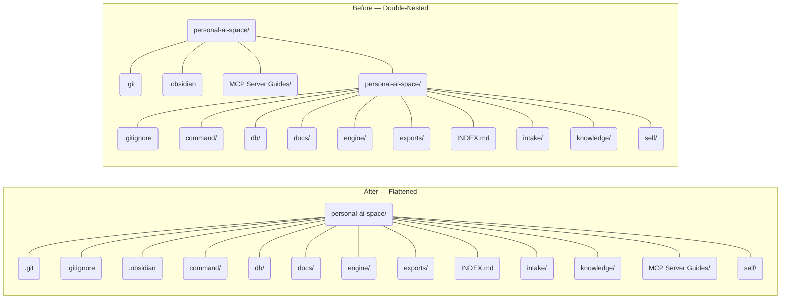

# Folder Structure — Before & After

**Key change:** the inner `personal-ai-space/` directory was eliminated. Its children (`.gitignore`, `command/`, `db/`, `docs/`, `engine/`, `exports/`, `INDEX.md`, `intake/`, `knowledge/`, `self/`) moved up one level to sit directly under the outer `personal-ai-space/` alongside `.git`, `.obsidian`, and `MCP Server Guides/`.
